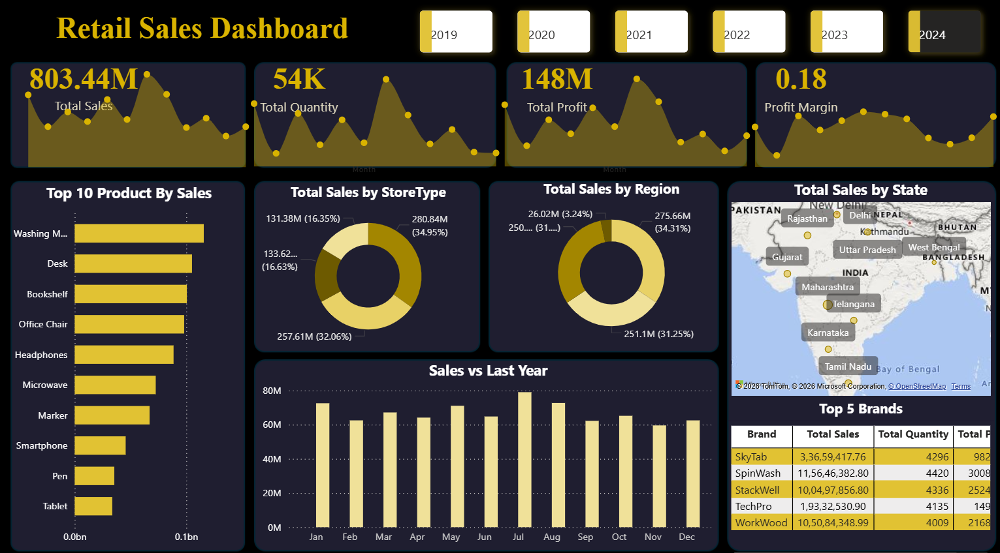

# 📊 Retail Sales KPI & Performance Insights Dashboard

An interactive Power BI dashboard developed to analyze retail sales performance, monitor business KPIs, and uncover revenue trends across products, regions, and store categories.

The project focuses on transforming raw sales data into meaningful business insights through KPI reporting, trend analysis, and interactive visual storytelling. The dashboard enables users to evaluate sales performance, identify high-performing products, monitor regional sales distribution, and analyze profitability trends through dynamic reporting visuals.

This project demonstrates dashboard development, KPI analysis, DAX calculations, data modeling, and business-focused reporting techniques using Power BI.

---

# 📌 Executive Summary

This project analyzes retail sales performance data to generate interactive business insights and KPI-driven reporting using Power BI.

The dashboard consolidates transactional sales data into a centralized reporting solution featuring revenue tracking, profitability analysis, product performance insights, and regional sales distribution. Through DAX calculations, data modeling, and visual analytics, the project transforms raw business data into actionable insights for performance monitoring and strategic decision-making.

The analysis revealed seasonal sales peaks during mid-year periods and identified specific product categories contributing significantly to overall revenue growth.

---

# 🎯 Business Problem

Retail businesses often manage large volumes of sales data across multiple products, regions, and store formats. Without centralized reporting systems, tracking business performance, monitoring KPIs, and identifying sales trends becomes inefficient and time-consuming.

The challenge was to build an interactive dashboard capable of:
- Monitoring sales performance in real time
- Tracking revenue and profitability KPIs
- Identifying high-performing products
- Analyzing regional sales distribution
- Supporting data-driven business decisions

This project addresses the problem by developing a dynamic Power BI dashboard that converts raw sales data into clear, visually interactive business insights.

---

# 🛠 Methodology

## 📂 Data Preparation & Modeling
- Imported and structured retail sales datasets in Power BI
- Cleaned and transformed data for reporting workflows
- Built relational data models for dashboard analysis

## 📊 KPI & Sales Analysis
Analyzed key business metrics including:
- Total Sales
- Total Quantity Sold
- Total Profit
- Profit Margin

## 🧮 DAX Calculations
Developed calculated measures and KPIs using DAX for:
- Profitability analysis
- Revenue calculations
- Dynamic dashboard filtering

## 📈 Dashboard Development
Built interactive visualizations featuring:
- Monthly sales trends
- Regional performance analysis
- Product-wise revenue contribution
- Store category analysis
- Dynamic slicers and filters

---

# 💡 Skills Demonstrated

- Power BI Dashboard Development
- KPI Reporting
- DAX Calculations
- Data Modeling
- Data Visualization
- Business Intelligence
- Sales Performance Analysis
- Exploratory Data Analysis (EDA)
- Dashboard Storytelling
- Interactive Reporting

---

# 📈 Key Insights & Results

- Identified mid-year sales peaks contributing significantly to annual revenue performance.
- Analyzed top-performing products driving overall sales growth.
- Evaluated regional sales distribution to identify stronger-performing markets.
- Built KPI dashboards enabling interactive business performance monitoring.
- Improved visibility into sales and profitability trends through centralized reporting visuals.

---

# 🚀 Dashboard Features

## 📌 KPI Metrics
- Total Sales
- Total Quantity Sold
- Total Profit
- Profit Margin

## 📊 Trend Analysis
- Monthly sales performance tracking
- Revenue trend visualization

## 🛍️ Product Analysis
- Top 10 products by sales
- Product contribution analysis

## 🌍 Regional Analysis
- Region-wise sales distribution
- State-level performance insights

## 🏬 Store Analysis
- Sales breakdown by store type
- Category-level comparisons

## 🎛️ Interactive Features
- Dynamic year slicers
- Interactive filtering
- Drill-down analysis

---

# 🚀 Business Recommendations

- Focus inventory and promotional strategies around high-performing product categories.
- Investigate seasonal sales trends to optimize marketing and operational planning.
- Expand sales strategies within top-performing regions while addressing weaker markets.
- Enhance KPI monitoring workflows for continuous performance tracking.

---

# 🔮 Next Steps

If given additional time, the project could be enhanced by:

- Integrating customer segmentation and purchasing behaviour analysis.
- Adding forecasting models for future sales prediction.
- Implementing profitability and margin trend analysis dashboards.

---

# 🧠 Tech Stack

| Category | Tools |
|---|---|
| Dashboarding | Power BI |
| Analysis | DAX |
| Data Modeling | Power BI Data Model |
| Visualization | Power BI Visuals |

---

# 📸 Dashboard Preview

---

# 📁 Project Files

| File | Description |
|---|---|
| `Retail_Sales_Dashboard.pbix` | Power BI dashboard file |
| `Dashboard.png` | Dashboard preview image |
| `README.md` | Project documentation |

---

# ▶️ How to Use

1. Download the `.pbix` dashboard file  
2. Open using Power BI Desktop  
3. Explore dashboard visuals and interactive slicers  

---

# 👩‍💻 Author

**Sneha H**  
Data Analyst | Power BI · SQL · Python · Excel
